# Developer Guide

--------------------------------------------------------------------------------------------------------------------

## Table of Contents

- [Acknowledgements](#acknowledgements)
- [Design](#design)
  - [Architecture](#architecture)
  - [UI](#ui)
  - [ProcessCommand](#processcommand)
  - [Storage](#storage)
  - [Exceptions](#exceptions)
- [Implementation](#implementation)
  - [Expenditure Tracker](#expenditure-tracker)
  - [GPA Calculator](#gpa-calculator)
  - [Mathematical Graph Demo](#mathematical-graph-demo)
  - [Timetable Tracker](#timetable-tracker)
  - [Motivational Quotes](#motivational-quotes)
- [Appendix](#appendix)
  - [Product Scope](#product-scope)
  - [User Stories](#user-stories)
  - [Non-Functional Requirements](#non-functional-requirements)
  - [Glossary](#glossary)
  - [Instructions for Manual Testing](#instructions-for-manual-testing)
    - [Launch and Shutdown](#launch-and-shutdown)
    - [Help](#show-help)
    - [Expenditure Tracker](#expenditure-tracker-1)
    - [GPA Calculator](#gpa-calculator-1)
    - [Math Graph Demo](#mathematical-graph-demo-1)
    - [Timetable Tracker](#timetable-tracker-1)

--------------------------------------------------------------------------------------------------------------------

## Acknowledgements

We referenced [AddressBook_Level3](https://github.com/se-edu/addressbook-level3) by using their 
[User Guide](https://github.com/AY2324S2-CS2113T-T09-4/tp/blob/master/docs/UserGuide.md) and
[Developer Guide](https://github.com/se-edu/addressbook-level3/blob/master/docs/DeveloperGuide.md) to help us structure our own documents.

We used [PlantUML integration](https://plantuml.com/starting) plugin to help us create our diagrams.

We used [PlantUML webpage](https://plantuml.com/) to understand PlantUML syntax.

--------------------------------------------------------------------------------------------------------------------

## Design

### Architecture

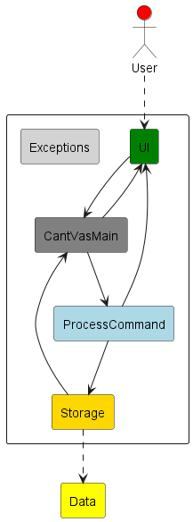

The **Architecture Diagram** above explains the high-level design of CantVas.

Given below is a quick overview of main components and how they interact with each other.

**Main components of the architecture**

`CantVasMain` is in charge of the launch and shut down of CantVas. 

The bulk of the app's work is done by the following three components:

- [`UI`](#ui): The UI of CantVas.
- [`ProcessCommand`](#processcommand): Parses user input and executes the command.
- [`Storage`](#storage): Reads and write data to the respective text file for each feature.

[`Exceptions`](#exceptions) represents the exceptions used by other components.

### UI

**API:** [`UI.java`](https://github.com/AY2324S2-CS2113-W13-3/tp/blob/master/src/main/java/cantvasui/UI.java)

How `UI` works:
1. Reads in user input and send the command to `CantVasMain` for parsing and execution. 
2. Prints an output based on user input. 
3. Reads in user input for steps in GPA calculator.

**Diagrams**

*Class Diagram*

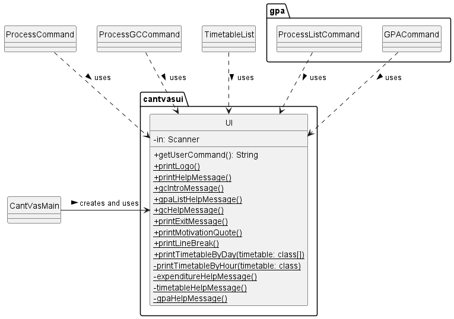

The class diagram above illustrates that `CantVasMain` instantiates the `UI` class,
while other classes have dependencies on `UI`, as they utilize its methods.

*Sequence Diagram*

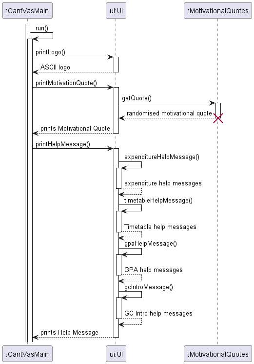

The Sequence diagram above illustrates the interaction between `CantVasMain` and `UI` when the program starts.

### ProcessCommand

**API:** 
[`ProcessCommand.java`](https://github.com/AY2324S2-CS2113-W13-3/tp/blob/master/src/main/java/processusercommands/ProcessCommand.java)

How `ProcessCommand` works:
1. `CantVasMain` receive the user input from `UI` and passes it to `ProcessCommand`.
2. Depending on the type of command, `ProcessCommand` passes the command to
   1. `processExpenditureUserCommand` or `TimetableParser` if the command is for expenditure 
   and timetable to further parse the command.
   2. `GPACommand` or `ProcessListCommand` for GPA calculator to receive more user inputs.
3. Returns true to `CantVAsMain` when the `exit` command is entered, ends CantVas.

**Diagrams**

*Class Diagram*

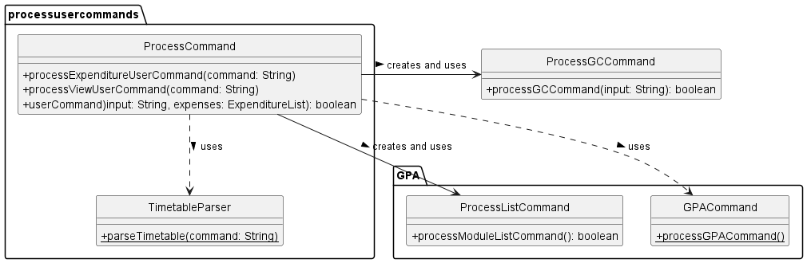

The class diagram above showcases the various classes leveraged by 
`ProcessCommand` to facilitate its task of parsing and executing commands.

*Sequence Diagram*

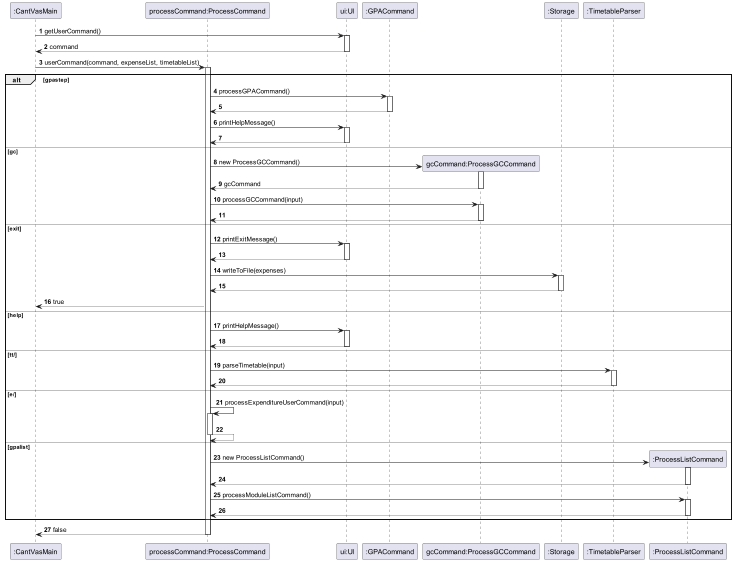

The sequence diagram above illustrates how user input is parsed 
and executed when passed to `ProcessCommand`.

### Storage

**API:** [`Storage.java`](https://github.com/AY2324S2-CS2113-W13-3/tp/blob/master/src/main/java/storage/Storage.java)

How `Storage` works:
1. Saves expenditure list, timetable list and gpa list in its respective text file.
   All text will be in a folder called data for easy location.
2. When `ProcessCommand` receives the `exit` command, `Storage` writes expenditure and
   timetable lists to their respective text file for saving.
3. `Storage` will instantiate ExpenditureList, TimetableList and ModuleList to store data read
   from the text file before passing it to other classes. 
4. If a text file or the data directory is not found when trying to read,
   `Storage` will create a new file/ directory and return an empty list to the caller. 
5. Reads in data from text file and process the data into strings to pass into
   `addExpenditure`, `addModule` and `addClass` methods.
6. `PrintWriter` and `File` and `Scanner` classes are responsible 
   for the writing, opening and reading from files respectively.

**Diagrams**

*Class Diagram*

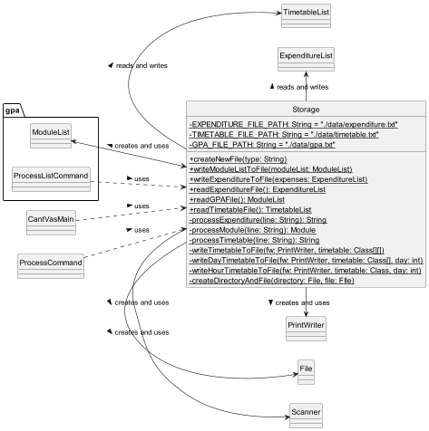

The class diagram above illustrates the classes that is associated or is dependent on `Storage`.

### Exceptions

**API:** [`InvalidInputFormatException.java`](https://github.com/AY2324S2-CS2113-W13-3/tp/blob/master/src/main/java/exceptions/InvalidInputFormatException.java)

How `Exceptions` work:
1. Throws an error message when the user enters an input that 
   has the wrong format and the user will be informed about their wrong format.
2. Takes in an error message when thrown that can be printed.

###### [Back to table of contents](#table-of-contents)

--------------------------------------------------------------------------------------------------------------------

## Implementation

### Expenditure Tracker

The Expenditure Tracker simplifies expense tracking, allowing users
to log daily spending. With filters for month, year, and type, it 
aims to promote financial awareness, aiding informed decision-making
for better financial health.

The `ExpenditureList` class is responsible for managing a collection of
expenditures. It provides methods for adding, deleting and listing expenditures.

The `Expenditure` class represents individual expenditure instance within the system.
Each expenditure object contains key attributes such as description, type, amount and date.

The class diagram below illustrates the relationship between `ExpenditureList` and `Expenditure` class.

*Class Diagram*

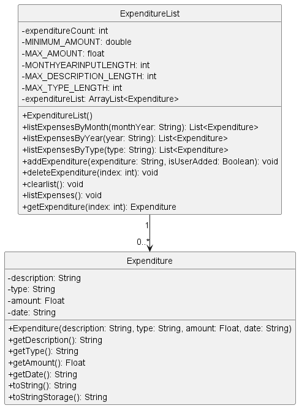

How `Expenditure` works:
1. When a new expenditure is added, `ExpenditureList` creates a new
   `Expenditure` object with the provided details and adds it to the expenditureList.
2. When an expenditure is deleted, `ExpenditureList` removes the `Expenditure` object
   at the specified index from the expenditureList.
3. When expenditures are listed, `ExpenditureList` iterates over the expenditureList
   and calls the toString() method of each `Expenditure` object to get a string representation
   of the expenditure.
4. When expenditures are listed by month, year, or type, `ExpenditureList` filters the
   expenditureList based on the specified criteria and returns a new list of `Expenditure`
   objects that match the criteria.
5. The isValidDate(), isValidMonth(), isValidAmount(), isValidType(), and isValidDescription()
   methods in `ExpenditureList` are used to validate the details of an expenditure before it
   is added to the expenditureList.

#### Add expenditure

Allows user to add a new expenditure to the expenditure list, it is optional for the users to
specify a type, the type would be left as NA should they choose not to add a type.

Format without type: `e/ add/ d/ <description> amt/ <cost> date/ <dd.mm.yyyy>`. 

Format with type: `e/ add/ d/ <description> t/ <type> amt/ <cost> date/ <dd.mm.yyyy>`.

**SequenceDiagram**

The sequence diagram above illustrates how `ExpenditureList` goes about validating user input
and adding the new expenditure.

**Design Considerations:**

**Aspect:** How add expenditure with and without type is handled in processCommand.

- **Alternative 1 (Current Choice):** As an optional input in add expenditure.
  - Pros: Minimal Changes - Modifying the existing method requires fewer alterations to the codebase.
  - Cons: Risk of Misuse - Users might overlook the optional input, leading to incorrect or incomplete data entry.

- **Alternative 2:** A new method just to handle add expenditure with type.
  - Pros: Enhanced Validation - A dedicated method can enforce stricter validation rules for expenditures with type.
  - Cons: Complexity - Introducing a new method adds complexity to the codebase.

#### Viewing all expenditures:

Allows user to view their whole expenditure list.

Format: `e/ list/`.

**SequenceDiagram**

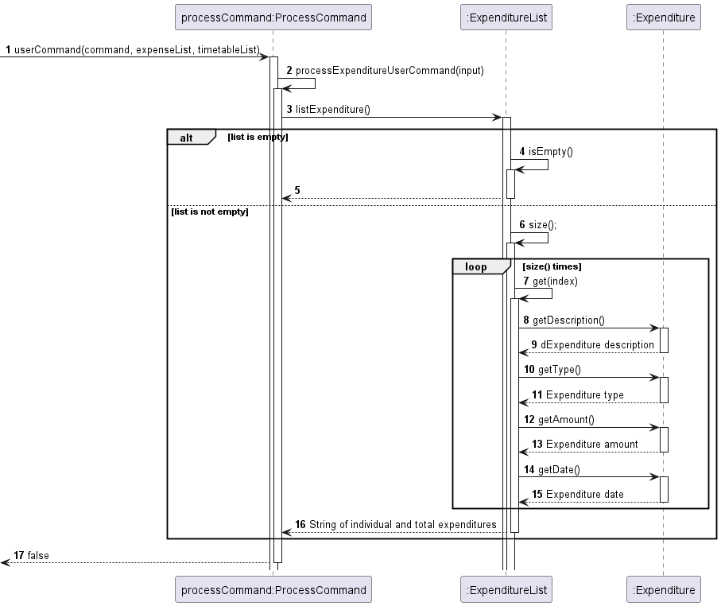

The sequence diagram above illustrates how `ExpenditureList` retrieve the information from
`Expenditure` to print the list.

#### Viewing expenditures by month:
Viewing an expenditure in numerical form, filtered by month.

Format: `e/ view/ m/ <mm.yyyy>`.

#### View expenditure by year:
Viewing an expenditure in numerical form, filtered by year.

Format: `e/ view/ y/ <yyyy>`.

#### View expenditure by type:
Viewing an expenditure in numerical form, filtered by type.

Format: `e/ view/ t/ <type>`.

**SequenceDiagram**

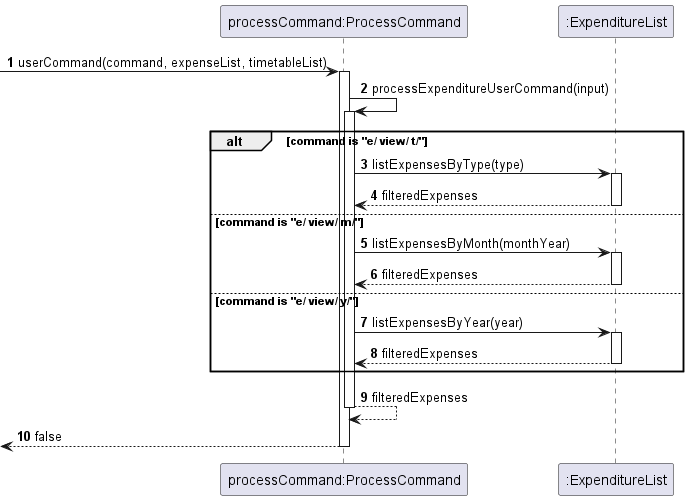

The sequence diagram above illustrates how `ProcessCommand` determines which method to call in `ExpenditureList`.

#### Delete expenditure:
Deleting an expenditure in numerical form, by referencing its index in the array.

Format: `e/ del/ <index>`.

**SequenceDiagram**

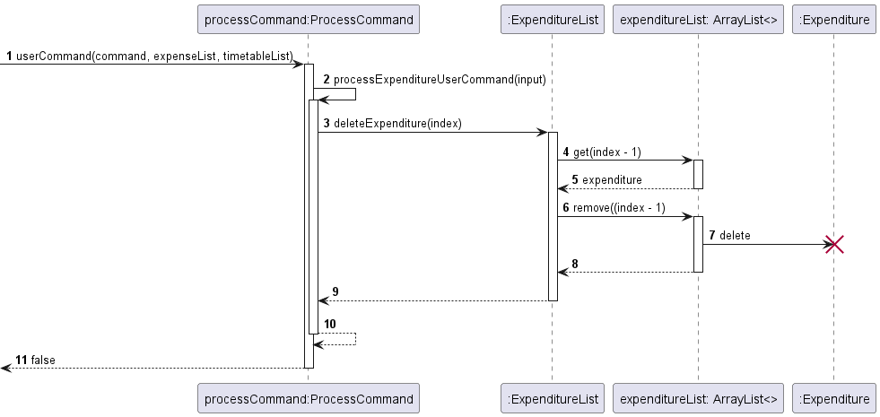

The sequence diagram above illustrates how the `Expenditure` object is deleted from the list.

###### [Back to table of contents](#table-of-contents)

------------------------------------------------------------------------------------------

### GPA Calculator

The GPA Calculator Module is a comprehensive component designed to facilitate the calculation 
of a user's updated GPA based on their current academic standing and projected module grades.
This guide will walk developers through the architecture, functionality, and core components of the module.

#### Overview
The module is divided into 5 classes dealing with 2 different calculation methods.

*Class Diagram*
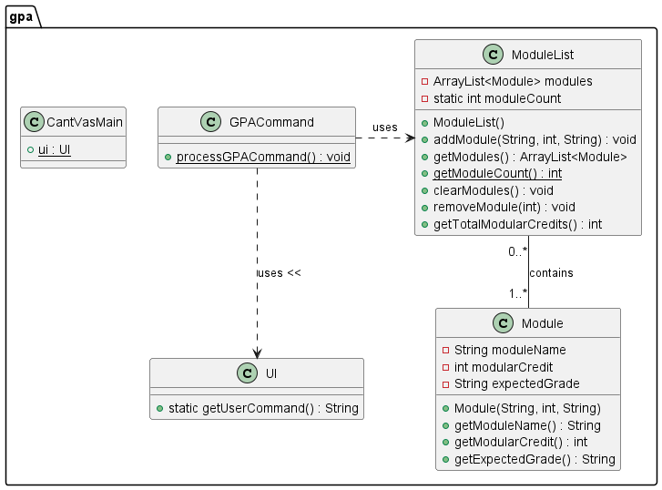

ModuleList and Module: The diagram shows a composition relationship between ModuleList and Module, denoted by a 
solid diamond and a line. This indicates that ModuleList contains Module instances and manages their lifecycle. 
The "0..*" next to Module implies that a ModuleList can contain zero or more Module instances.

#### Module
Handles user input of module information: module name, module weightage and module grade.

Here we demonstrate the Sequence Diagram with sample input CS1010 with 4 MC and A grade.

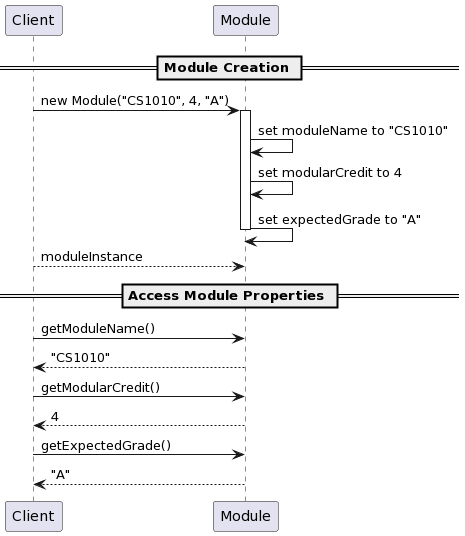

#### ModuleList
This extends Module class, which is used to execute actions like add/delete/view regarding the 
module list.

Here we demonstrate the Sequence Diagram with sample input CS1010 with 4 MC and A grade.

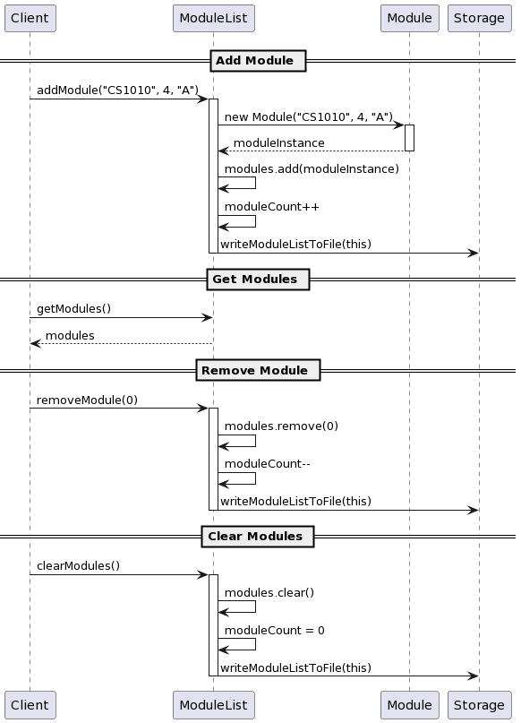

#### GPACommand
This class is responsible for interacting with the user, collecting inputs,
and managing the flow of the GPA calculation process. It operates within a loop,
allowing the user to perform multiple calculations or exit at any point.

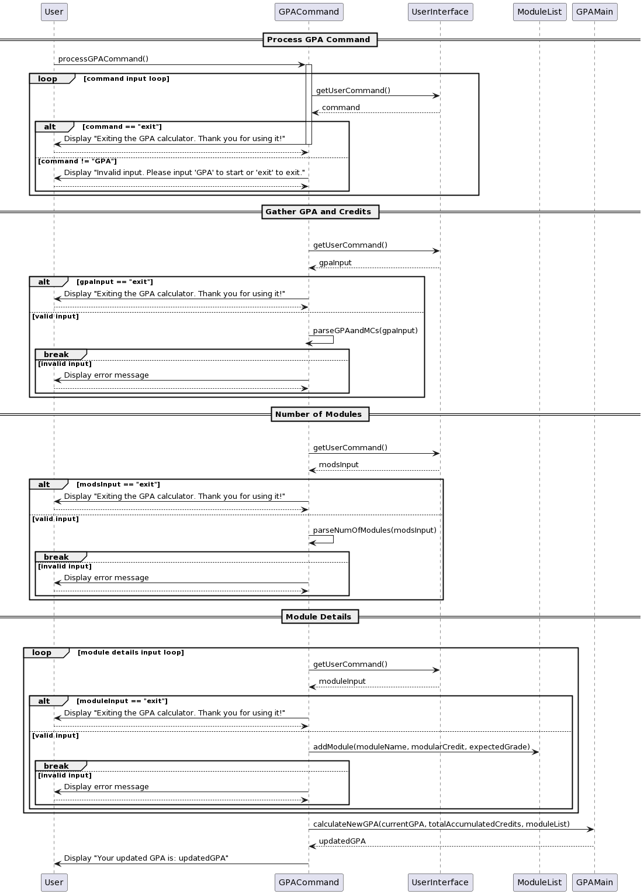

#### GPAMain: 
Contains the logic for calculating the GPA.

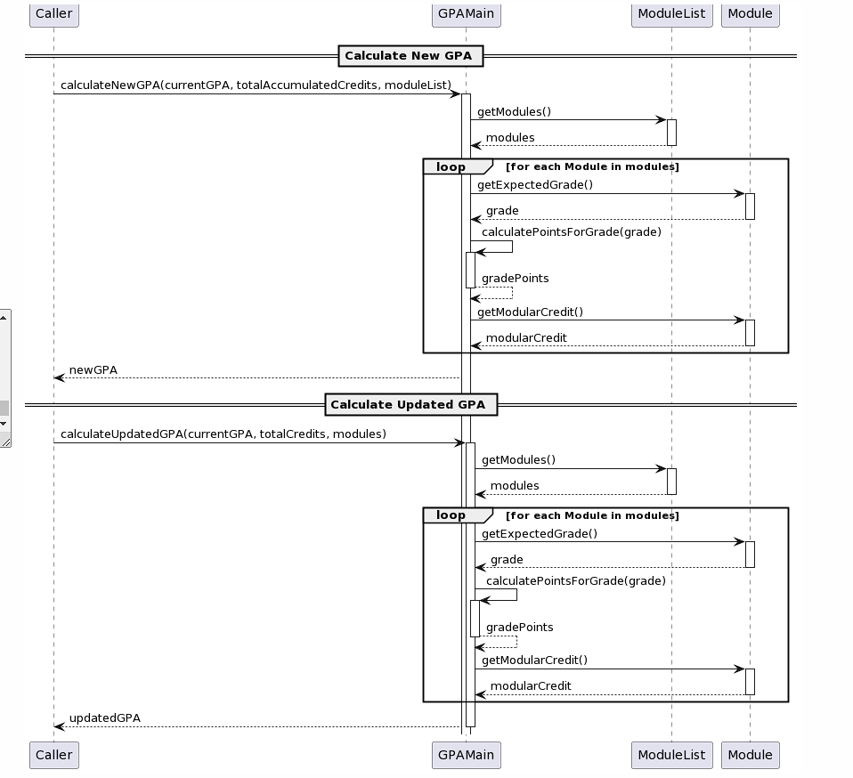

#### ProcessListCommand
This class is in charge of calculation of GPA by Module List method by identifying user's input.

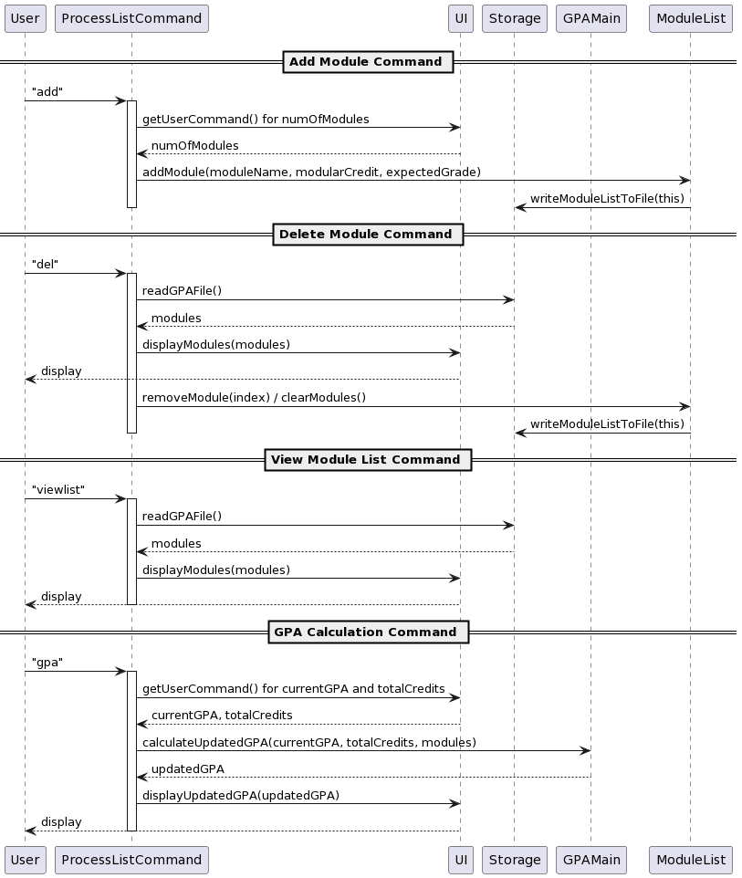

### Workflow for step-by-step GPA calculator
#### Start/Exit Prompt: 
Prompt the user to start the calculation or exit.
#### GPA and MCs Input: 
Collect the user's current GPA and the number of Modular Credits (MCs) taken.
#### Module Details Input: 
For each module the user wants to add, collect the module name ,modular credit and the expected grade.
#### GPA Calculation: 
Calls GPAMain.calculateNewGPA to compute the updated GPA based on inputs.
#### Display Updated GPA: 
Displays the calculated updated GPA to the user.

### Workflow for module list GPA calculator
#### Adding module 
User can access this via `add` command.
#### Store Module information into txt file
Modules information will be stored into the `gpa.txt` file in data folder.
#### Delete/Edit modules list
User can access this function via `del` command. User will be prompt to either delete specific module
information, or to clear the whole module list.
#### View Current Module List
Can be accessed via `viewlist` command. Current module list information will be printed out 1 by 1.
#### GPA calculation
Can be accessed via `gpa` command.
After prompted to input current GPA and numbers of MC taken.
The program will automatically output the GPA based on the information store in the Module List.
User is prompt to edit the module list first before proceed with calculation.

#### Key Methods
#### calculateNewGPA()
input: double currentGPA, int totalAccumulatedCredits, int numOfModules, int[] moduleCredits, String[] moduleGrades
Calculates and returns the updated GPA.

#### GPA Calculation Logic
#### Total Points Calculation: 
Calculates the total points achieved so far by multiplying the current GPA by the total accumulated credits.
#### Add Points for New Modules: 
For each new module, add to the total points based on the grade and credits.
#### Calculate Updated GPA: 
Divide the total points by the new total credits (accumulated + new modules) to get the updated GPA.

###### [Back to table of contents](#table-of-contents)

------------------------------------------------------------------------------------------

### Mathematical Graph Demo

#### Overview
The Graph Demo function uses JPanel , which is a simple GUI tool in javax.swing package.
With pre-written formula and defined size of parameters, therefore we can demonstrate the
mathematical formula with illustration.

**Class Diagram**

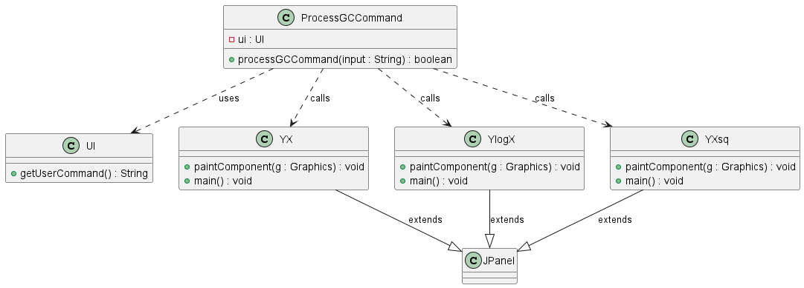

#### Classes and Methods:
- `ProcessGCCommand`: Manages user commands to trigger specific graphical displays or other functionalities.
- `UI`: Provides a method to get user commands from the console.
- `YX`, `YlogX`, `YXsq`: Each of these classes extends JPanel and includes methods to paint specific 
mathematical graphs 
(y = x, y = log(x), and y = x^2, respectively) and a main method to create and show a JFrame displaying the graph.

#### Relationships:
- Dependency: ProcessGCCommand depends on UI to receive user input.
- Association: Indicates that ProcessGCCommand can call methods in the `YX`, `YlogX`, and `YXsq` classes based 
on user input.

#### Inheritance:
- Each graph class (`YX`, `YlogX`, `YXsq`) is shown to inherit from JPanel, signifying that they are specialized panels 
used for drawing specific types of graphs.

**Sequence Diagram**

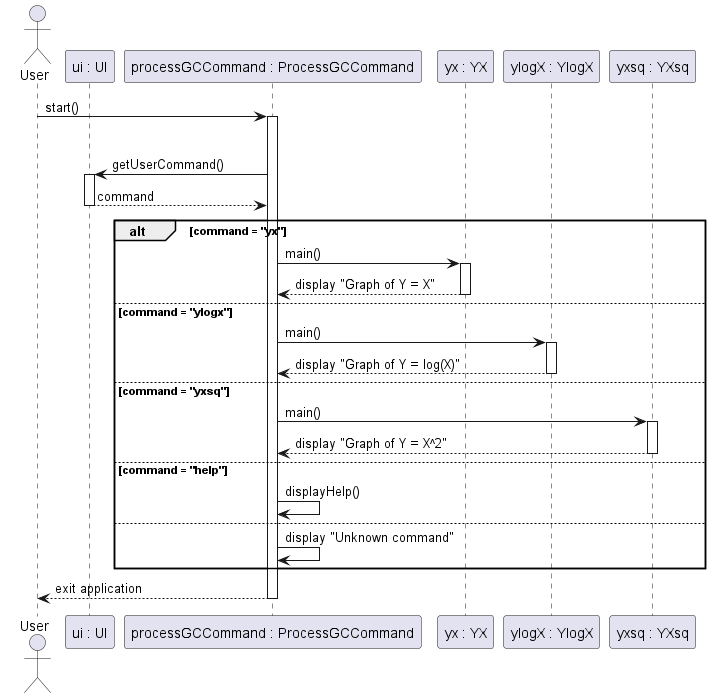

How `GC` works:
1. `ProcessGCCommand` utilizes the UI class to continuously fetch user commands. 
2. Inside the `ProcessGCCommand`, a loop runs awaiting commands from the `UI`. 
3. Once a command is received, it's processed in a switch-case structure:
   - `yx`: If the command is `yx`, the `ProcessGCCommand` invokes `YX.main()`, which sets up and displays a JFrame 
   with the graph y = x.
   - `ylogx`: If the command is `ylogx`, it calls `YlogX.main()`, which displays the graph y = log(x).
   - `yxsq`: If the command is `yxsq`, it triggers `YXsq.main()`, showing the graph y = x^2.
   - `exit`: The `exit` command breaks the loop and typically closes the application or returns to a previous menu.
   - `help`: Displays available commands, which helps users understand what commands are available.
4. Each graph class (`YX`, `YlogX`, `YXsq`) extends JPanel, which is crucial for drawing the graphs. 
They override the `paintComponent(Graphics g)` method where the actual drawing logic is implemented:
   - These methods set up the graph axes and draw the respective mathematical functions using Java's Graphics API.
   - When `main()` is called on any of these classes, a JFrame is instantiated, the respective JPanel (graph) is added, 
   and the frame is displayed.
5. Users see the JFrame pop up with the desired graph and can close it or return to enter another command.
This cycle continues until the `exit` command is processed

###### [Back to table of contents](#table-of-contents)

------------------------------------------------------------------------------------------

### Timetable Tracker

The timetable tracker facilitates the management of class schedules. It aims to provide users with a 
convenient way to organize and track their classes throughout the week. Users can add, delete, 
and view classes based on specific days, enabling efficient scheduling and time management 
enhancing the overall productivity and organization of users.

The `TimetableParser` class is responsible for parsing commands related
to timetable tracker and calling the respective methods in `timetableList`.

The `TimetableList` class is responsible for managing a collection of classes.
It provides methods for adding, deleting and listing timetable. `TimetableList` makes
use of a 2d array to store the classes, an array for each weekday and an internal array
for each hour of the day.

The `Class` class represents individual class instance within the system.
Each class object contains key attributes such as code, time, duration and location.

The class diagram below illustrates the relationship between `TimetableList` and `Class` class.

**Class Diagram**

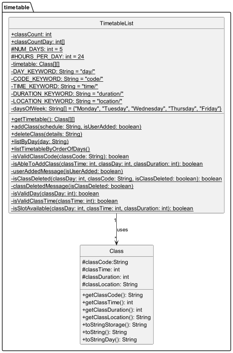

How `Timetable` works:
1. When a new class is added, `TimetableList` creates a new `Class` object with the provided details
and adds it to the timetableList based on the day and time of the class. This is repeated with a decreasing 
class duration and increasing class time until the class duration reaches 0.
2. When a class is deleted, `TimetableList` iterates through the array for the day and looks for
classes with the same class code as what the user input and deletes the `Class` object from the 2d array.
3. When the timetable is listed for the whole week, `TimetableList` iterates through the 2d array starting from monday, 
00:00 and prints the details if there is a class.
4. When the timetable is listed for a specific day, `TimetableList` iterates through the array for that day
and prints the details if there is a class.
5. The isSlotAvailable(), isValidDay(), isValidClassTime(), isValidClassCode() and isAbleToAddClass() methods in
`TimetableList` are used to validate whether the user input is correct and whether there is any conflict with the
existing timetable before the class is added or deleted from the array.

**Design Considerations:** 

**ASPECT:** What the timetable list is store in.

- **Alternative 1 (Current Choice):** As a 2d array.
  - Pros: Prevents Overlapping Classes: With a structured 2D array representing time slots, 
  it's easier to enforce constraints to prevent overlapping classes.
  - Cons: Fixed Size: It might be less flexible if the timetable size needs to be adjusted dynamically.
  Not able to store timetable in half hours.

- **Alternative 2:** As 5 array list, 1 for each day.
  - Pros: Flexibility: Each day's timetable can be managed independently, 
  providing more flexibility in adding, removing, or modifying classes.
  - Cons: Indirect Access: Accessing elements might be slightly less efficient compared to 
  direct indexing in a 2D array, as it involves traversing ArrayLists.

#### Add Class

Allows users to add classes to the timetable, provided there is no existing class already in the time slot.

Format: `tt/ add/ day/ <day> code/ <classCode> time/ <hh> duration/ <duration> location/ <location>`.

**SequenceDiagram**

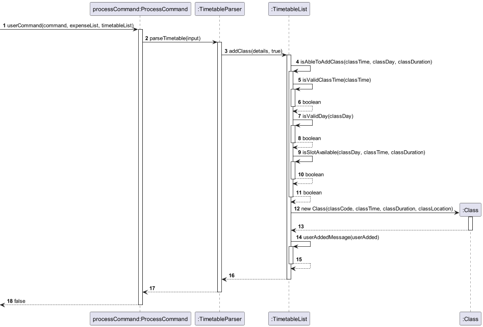

The sequence diagram above illustrates how `TimetableList` goes about validating user input and adding the new class.

#### List Class

View classes in order of day and time.

Format: `tt/ list/`.

**SequenceDiagram**

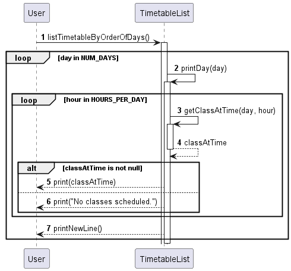

The sequence diagram above illustrates how `TimetableList` iterates through the 2d array to list the timetable.

#### List Class by day

View classes for a specific day.

Format: `tt/ list -d/ <day>`.

**SequenceDiagram**

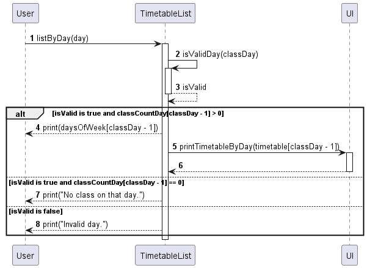

The sequence diagram above illustrates how `TimetableList` iterates through the array for the day 
to list the timetable for the day.

#### Delete Class

Deletes all class on the day that has the same class code as the user input.

Format: `tt/ del/ day/ <day> code/ <code>`.

**SequenceDiagram**

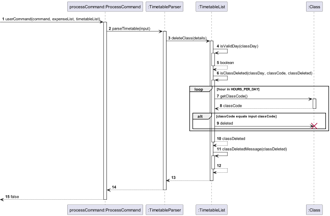

The sequence diagram above illustrates how `TimetableList` iterates through the array for the day to check for
similar class code before deleting the `Class` object from the array.

###### [Back to table of contents](#table-of-contents)

------------------------------------------------------------------------------------------

### Motivational Quotes

The Motivational module prints a randomly generated motivational quote from the fixed array for the user whenever the program starts.
It uses inbuilt random class from java.util to randomly generate an index to select the motivational quote to display

**Class Diagram**

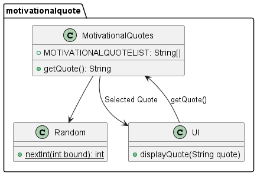

The class diagram above illustrates the classes associated with `MotivationalQuites`.

**SequenceDiagram**

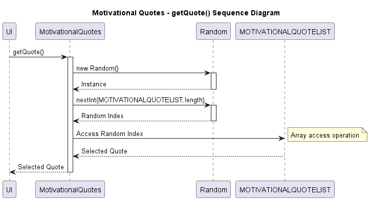

The sequence diagram above illustrates how `MotivationalQuotes` gets a random quote from the quote list.

###### [Back to table of contents](#table-of-contents)

------------------------------------------------------------------------------------------

## Development Notes
Input Validation: Ensure that GPA scores and credit numbers are within valid ranges. This module expects a GPA between 0 and 5, and non-negative numbers for credits.

Error Handling: Properly handle invalid inputs, such as non-numeric values for credits or unsupported grade values.

Assertions: Use assertions to catch unexpected values during development. Ensure they are adequately handled or logged.

## Future Enhancements
GUI Integration: Consider developing a graphical user interface for easier input and interaction.

Persistent Data: Implement functionality to save and retrieve historical GPA calculations.

Expanded Grade Scale: Allow for customization of the grade to GPA points mapping to accommodate different institutions' grading scales.

###### [Back to table of contents](#table-of-contents)

--------------------------------------------------------------------------------------------------------------------

## Appendix

### Product scope

#### Target user profile

- NUS Students
- Prefers typing

#### Value proposition

CantVas offers users the ability to efficiently monitor their expenses, enabling them to enhance 
their financial management skills. Additionally, students can utilize CantVas to calculate their GPA grades, 
facilitating academic success. With its versatile functionality, CantVas serves as a comprehensive 3-in-1 
solution for users to manage expenditure, timetable, and GPA, thereby enhancing their overall organizational 
capabilities and productivity.

### User Stories

| Version | As a ...                                | I want to ...                                                  | So that I can ...                                                                 |
|---------|-----------------------------------------|----------------------------------------------------------------|-----------------------------------------------------------------------------------|
| v1.0    | international student on a budget       | use CantVas to add my purchases                                | meticulously record my expenses                                                   |
| v1.0    | analytical student                      | view a breakdown of his expenditures                           | focus on financial responsibility                                                 |
| v1.0    | budget-conscious student                | view my expenses filtered by specific months and years         | track my progress towards financial goals and identify any trends over time       |
| v1.0    | long-term planner                       | see an overview of my expenditures grouped by year             | evaluate my financial health and plan for future expenses accordingly             |
| v1.0    | student who wants to start fresh        | ability to delete all of my recorded expenditures              | reset my financial tracking system and begin anew                                 |
| v1.0    | careless user                           | delete wrong items in the expenditure tracker                  | add back the correct item in the expenditure tracker                              |
| v1.0    | user who needs assistance               | be able to access help information within the application      | understand how to use its features effectively                                    |
| v1.0    | user finished with my tasks             | be able to exit the application easily                         | close it and move on to other activities                                          |
| v1.0    | Proactive business major                | calculate my course grades on CantVas step by step             | see which mod I have to SU                                                        |
| v1.0    | user who values user assistance         | access help information and exit the GPA calculator easily     | get assistance if needed and navigate the application seamlessly                  |
| v2.0    | organized student                       | add my expenses by type                                        | understand where my money is going and make informed financial decisions          |
| v2.0    | strategic spender                       | categorize and view my expenditures by type                    | identify areas where I can potentially cut costs or adjust my budget.             |
| v2.0    | user seeking daily inspiration          | see motivational quotes and tips CantVas provides at startup   | stay motivated throughout her academic journey                                    |
| v2.0    | student trying to organize my schedule  | input my classes into the timetable tracker                    | keep track of the classes I have                                                  |
| v2.0    | student who needs to adjust my schedule | remove specific classes from my timetable                      | ensure the timetable accurately reflects my current commitments                   |
| v2.0    | student planning for the upcoming week  | see all my classes scheduled for the week in one place         | plan my study and extracurricular activities efficiently                          |
| v2.0    | student organizing my daily tasks       | check my classes for a specific day                            | focus on the tasks and commitments for that day without feeling overwhelmed       |
| v2.0    | meticulous user                         | add modules to the list by inputting their details             | maintain a comprehensive record of all the modules I've taken for GPA calculation |
| v2.0    | detail-oriented student                 | edit the module list by deleting then adding                   | ensure the accuracy of my GPA calculation                                         |
| v2.0    | student who overloaded                  | have a module list that keeps track of the modules I am taking | view the grades for each module                                                   |
| v2.0    | student who forgot my basics            | see a graph demo                                               | so that I can remember how mathematical equations are like in graphical form      | 

###### [Back to table of contents](#table-of-contents)

### Non-Functional Requirements

1. Should be portable and working on any mainstream OS as long as it has Java 11 or above installed.
2. Should be able to hold up to 1000 or more expenditure without any change in performance of CantVas.
3. Should be able to handle exceptions and edge cases for smooth operation.
4. A user with an average typing speed in regular English text (not code or system admin commands) should find that
   they can complete most tasks more quickly using text commands rather than relying on the mouse.
5. Comprehensive unit tests should be implemented within the application to guarantee accurate functionality,
   streamline maintenance, and facilitate future enhancements.

## Glossary

* *Mainstream OS*: Windows, Linux, Unix, macOS

## Instructions for manual testing

Given below are instructions on how to test the app manually.

### Launch and Shutdown

1. Initial launch
   1. Download the jar file and copy into an empty folder
   2. Open a terminal and change directory to the folder created with the jar file inside and 
   type java -jar CantVas.jar into the terminal.

2. Shutdown
   1. When CantVas is running, type `exit` to close CantVas.

### Show help

1. Prerequisites: NIL
2. Test case 1: `help`

   Expected: All commands and their format will be shown.

### Expenditure Tracker

#### Adding expenditure

1. Prerequisites: NIL
2. Test Case 1: `e/ add/ d/ shopping amt/ 128.00 date/ 31.03.2024`

   Expected: A new expenditure with type NA is added successfully.

3. Test case 2: `e/ add/ d/ spider-man tickets t/ movie amt/ 13.50 date/ 12.02.2024`

   Expected: A new expenditure with type MOVIE is added successfully.

#### View Expenditure

1. Prerequisites: Added the 2 expenditure in [Adding Expenditure](#adding-expenditure)
2. Test case 1: `e/ list/`
   
   Expected: The current expenditure list will be shown along with the total expenses.

3. Test case 2: `e/ view/ m/ 03.2024`

   Expected: The expenditure list for 03.2024 will be shown, 
   at least 1 should be the shopping expenditure previously added.

4. Test case 3: `e/ view/ y/ 2024`

   Expected: The expenditure list for 2024 will be shown,
   the 2 previously add expenditure should be shown.

5. Test case 4: `e/ view/ t/ movie`

   Expected: The expenditure list for type movie will be shown,
   at least 1 should be the spider-man tickets previously added.

#### Deleting expenditure

1. Prerequisites: List all expenditure using `e/ list/`
2. Test case 1: `e/ del/ 1`

   Expected: The first expenditure in the list will be deleted and the details will be shown.

3. Test case 2: `e/ clearlist/`
    
   Expected: The whole expenditure list should be cleared.
   No expenditure should be shown when `e/ list/` is entered.

### GPA Calculator

#### Method 1

1. Prerequisites: Enter the step by step gpa calculator using `gpastep` 
followed by `gpa` to start the calculator.
2. Test case 1: Enter the following input for each prompt:
   1. `4.00/24`
   2. `1`
   3. `n/CS1010 mc/4 gr/A+`

   Expected: Your updated GPA is: 4.14.

#### Method 2

1. Prerequisites: Enter the advanced gpa calculator using `gpalist`
2. Test case 1: `add`
   - Enter the following input for each prompt:
     - `2`
     - `n/CS1010 mc/4 gr/A+`
     - `n/CS1010 mc/4 gr/A+`
     
   Expected: 2 modules will be added.
3. Test case 2: `viewlist`
   
   Expected: The 2 module just added should be seen.

4. Test case 3: `del`, followed by `1`

5. Test case 4: `gpa`
   - Enter the following input for each prompt:
        - `4`
        - `24`
     
   Expected: Your GPA is: 4.14

### Mathematical Graph Demo

1. Prerequisites: Enter the GC screen using `gc`
2. Test case 1: `YX`

   Expected: Graph of Y = X should appear in an external screen.

3. Test case 2: `YlogX`

   Expected: Graph of Y = log(X) should appear in an external screen.

4. Test case 3: `YXsq`

   Expected: Graph of Y = X^2 should appear in an external screen.

### Timetable Tracker

#### Adding class

1. Prerequisites: NIL
2. Test case 1: `tt/ add/ day/ 5 code/ cs2113 time/ 16 duration/ 2 location/ LT16`

   Expected: Class is added successfully with the correct day, code, time, duration and location.

3. Test case 2: `tt/ add/ day/ 2 code/ cs2113 time/ 10 duration/ 1 location/ COM1-0210`

   Expected: Class is added successfully with the correct day, code, time, duration and location.

#### Viewing classes

1. Prerequisites: Added the 2 classes in [Adding class](#adding-class)
2. Test case 1: `tt/ list/`
    
   Expected: 1 class is shown on tuesday for cs2113 for a duration of 1 at 10,
   2 class for cs2113 will be shown with decreasing duration to represent
   the time left before the class ends.

3. Test case 2: `tt/ list -d/ 5`

   Expected: Friday timetable should be shown with the cs2113 class shown for 16:00 and 17:00.

#### Deleting class

1. Prerequisites: List add classes using `tt/ list/`, there should be cs2113 class on friday.
2. Test case 1: `tt/ del/ day/ 5 code/ cs2113`

   Expected: The cs2113 class on friday should be deleted. 
   No cs2113 class should be shown when `tt/ list -d/ 5` is entered.

###### [Back to table of contents](#table-of-contents)
