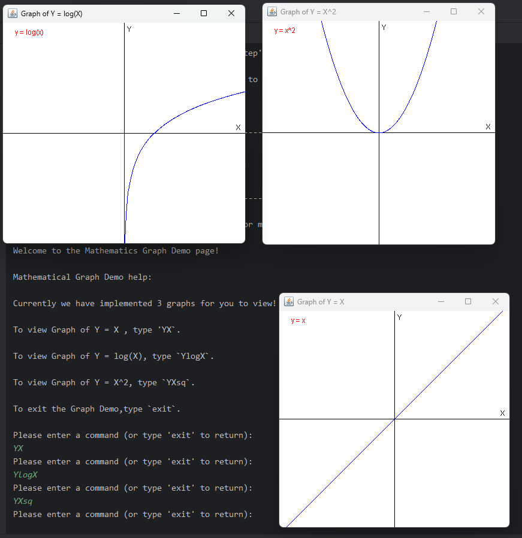

# User Guide

## Introduction

### Welcome to CantVas!

Congratulations on taking the first step towards smarter, more organized 
student life! CantVas is your ultimate companion for managing your academic 
and financial responsibilities with ease. Designed with students in mind, our 
app offers a comprehensive suite of tools to help you stay on top of your 
expenses, organize your timetable and track your grades.

--------------------------------------------------------------------------------------------------------------------

## Table of Contents
- [Introduction](#introduction)
- [Quick Start](#quick-start)
- [Features](#features)
  - [Expenditure Tracker](#expenditure-tracker)
    - [Adding expenditure without type](#adding-expenditure-without-type)
    - [Adding expenditure with type](#adding-expenditure-with-type)
    - [View all expenditure](#view-all-expenditure)
    - [View expenditure by month and year](#view-expenditure-by-month-and-year)
    - [View expenditure by year](#view-expenditure-by-year)
    - [View expenditure by type](#view-expenditure-by-type)
    - [Delete all expenditure](#delete-all-expenditure)
    - [Delete expenditure by index](#delete-expenditure-by-index)
  - [GPA Calculator](#gpa-calculator)
    - [Method 1](#method-1-step-by-step-gpa-calculator)
    - [Method 2](#method-2-calculation-of-gpa-by-modulelist)
  - [Math Graph Demo](#mathematical-graph-demo)
  - [Timetable Tracker](#timetable-tracker)
    - [Add class](#add-class)
    - [List all class for the week](#view-all-class-for-the-week)
    - [List class for the day](#view-class-for-the-day)
    - [Delete class](#delete-class)
  - [Motivational Quotes](#motivational-quotes)
- [FAQ](#faq)
- [Command Summary](#command-summary)

--------------------------------------------------------------------------------------------------------------------

## Quick Start
1. Ensure you have `Java-11` or above installed on your computer.
2. Download the latest version of `CantVas` from [here](https://github.com/AY2324S2-CS2113-W13-3/tp/releases).
3. Copy the jar file to your desired folder.
4. Open a command prompt in the same directory as the jar file.
5. Run `java -jar CantVas.jar` to run the application.

--------------------------------------------------------------------------------------------------------------------

## Features
CantVas includes the following 
features:
- Expenditure Tracker 
- GPA Calculator
- Math Graph Demo
- Timetable Tracker
- Daily Motivational Quotes

--------------------------------------------------------------------------------------------------------------------

### Expenditure Tracker
The expenditure tracker allows you to store, view, delete and filter the 
expenditures you have entered. Making it a good way to track your 
expenses.

The features include:

#### Adding expenditure without type
- Adding new expenditures without specifying the type. To do so, 
  key in with the following format:  
  `e/ add/ d/ <description> amt/ 
  <cost> date/ <dd.mm.yyyy>`. 
  - Example: `e/ add/ d/ self-help book amt/ 19.99 date/ 15.03.2024`.

> Doing so will leave the 'type' field empty and thus defaulting to 'NA'.
  When viewed using any list or view functions, the second column will be 'NA'.

> Note that there are input length restrictions to the expenditures. The description
  field should not exceed 100 characters and the type field should not exceed 20 
  characters.

#### Adding expenditure with type
- Adding new expenditures with type of expenditure specified. To
  do so, key in with the following format:  
`e/ add/ d/ <description> t/ <type> amt/ <cost> date/ <dd.mm.yyyy>`. 
  - Example: `e/ add/ d/ self-help book t/ book amt/ 19.99 date/ 06.04.2024`.

#### View all expenditure
- Viewing saved expenditures without filters. To do so, key in 
  with the following format:   
  `e/ list/`.

#### View expenditure by month and year
- Viewing saved expenditures by month and year. To do so, key in 
  with the following format:  
  `e/ view/ m/ <mm.yyyy>`. 
  - Example: `e/ view/ m/ 03.2024`.

#### View expenditure by year
- Viewing saved expenditures by year. To do so, key in with the
  following format:   
`e/ view/ y/ <yyyy>`.
  - Example: `e/ view/ y/ 2024`.

#### View expenditure by type
- Viewing saved expenditures by type. To do so, key in with the
  following format:   
  `e/ view/ t/ <type>`. 
  - Example: `e/ view/ t/ FOOD`.

#### Delete all expenditure
- Deleting the entire saved expenditure list. To do so, key in with the
  following format:   
`e/ clearlist/`.

#### Delete expenditure by index
- Deleting saved expenditures. To do so, key in with the following format:  
  `e/ del/ <index>`.
  - Example: `e/ del/ 2`.

--------------------------------------------------------------------------------------------------------------------

### GPA Calculator
The GPA calculator allows you to calculate your GPA, based on your previous GPA
and your new modules' grades and module credit numbers.

In CantVas, we provide 2 methods of GPA calculation.

#### Method 1: Step by Step GPA Calculator
Quick Start:

1. Starting from the main menu.
2. Type `GPASTEP` (Regardless of caps) to proceed to start the function.
3. Type Your `Current_GPA / Numbers_of_MCs_Taken`. Example: `4.00/24`
4. Type the numbers of modules taken for this semester. Example: `4`
5. Type in the details for each module taken.
In the format of: 
n/<Module_Name> mc/<Module_Credit> gr/<Expected_Grade>.
Example: `n/CS1010 mc/4 gr/A+` or  `n/CS2113 mc/4 gr/F`
6. Your GPA will be automatically calculated afterward.
> Modular credit should be a non-negative integer value between
0 and 12.

#### Method 2: Calculation of GPA by ModuleList
This method is for user who are more familiar with GPA calculation mechanism or 
they have too many modules to enter. This method provides them with the ease to 
edit their module list.

Quick Start:

1. Starting from the main menu.
2. Type 'GPALIST' (Regardless of caps) to proceed to start the function.
3. You will enter GPA Calculation by list mode.
4. First you are recommended to enter modules into the list by typing 
`add`.
5. After which you can input the numbers of modules that you would like to record
into the list by inputting an integer.
6. Type in the details for each module taken.
   In the format of:
   n/<Module_Name> mc/<Module_Credit> gr/<Expected_Grade>.
   Example: `n/CS1010 mc/4 gr/A+` or  `n/CS2113 mc/4 gr/F`.
7. After done with adding in modules, type `exit` to go back to sub-menu.
8. Now you can calculate your GPA by typing `gpa`.
9. Follow the prompt, input your current gpa and modular credits completed
so far in the format of `Current_GPA / Numbers_of_MCs_Taken`. Example: `4.00/24`.
10. Your GPA will be automatically calculated !
11. If you feels like editing the modules information, you can access it by 
typing `del` to delete specific module or to delete the whole list.

>Commands in GPALIST 
> 
> `help` : See the help list.
> 
> `del` : Delete specific module result record, or to delete
> everything.
> 
> `add` : Add modules' credit information and expected grade.
> 
> `viewlist` :To view what modules are in the list.
> 
> `gpa` : To calculate your gpa based on modules recorded in the list. If the module list is 
> empty, it will just return your current GPA. 
>
> `exit` : Go back to the previous page.

--------------------------------------------------------------------------------------------------------------------

### Mathematical Graph Demo
To fulfill students' requirement of knowing how mathematical equations are like in graphical form.
We have implemented a function named `GC` . 

To enter our graph demo, you can simply by typing `GC` in the main window.
After which you will be brought to the Graph Demo Page.

We have implemented 3 graphs so far.
Namely: 
>Y = X 
> 
> Y = log(X)
> 
> Y = X ^2

You can select  which graph you would like to see by typing  `YX` or `YXsq` or `YlogX` 
to view them in the pop-up window.

--------------------------------------------------------------------------------------------------------------------

### Timetable Tracker
The timetable tracker allows you to store, view and delete classes you
have entered for the current semester. Making it a good way to track what
are the classes, where are the classes and the class durations from monday
to friday respectively.

The features include:

#### Add class
- Adding new classes. To do so, key in with the following format:   
`tt/ add/ day/ <day> code/ <classCode> time/ <hh> duration/ <duration> location/ 
  <location>`. 
  - Example: `tt/ add/ day/ 3 code/ EE2026 time/ 09 duration/ 3 location/ E4-03-07`.
> Note that in this command: 
> 
> `day` refers to integers from 1 to 5, each mapping a day from monday to friday.
> For example, monday classes will have a day input of `1` and wednesday classes
> will have a day input of `3`.
> 
> `classCode` refers to the module/course identification code. All class Codes will 
> be automatically capitalised when saving ( Inputting "CS2113" will be the same as "cs2113" )
> 
> `time` refers to 24-hours in 2 digit integer format. For example, 1pm will 
> be inputted as `13` and 9am will be inputted as `09`. Note that there will be no classes
that cut across midnight. Hence `24` is not an accepted value.
> 
>`duration` refers to how long the class lasts. For example, if a class lasts for 3
> hours, the duration input will be `3`.

#### View all class for the week
- Viewing saved classes according the days in the week, arranged in ascending order of
  time. To do so, key in with the following format:   
`tt/ list/`.

#### View class for the day
- To view classes for the specific day of the week key in the following:  
  `tt/ list -d/ <day>`

#### Delete class
- Deleting saved classes. To do so, key in with the following format:   
 `tt/ del/ day/ <day> code/ <code>`. 
  - Example: `tt/ del/ day/ 3 code/ cs2113`.

--------------------------------------------------------------------------------------------------------------------

### Motivational Quotes
Feeling Down? Dread looking at your packed timetable?
CantVas is here to save your day and uplift your spirits whenever you need it most
(when looking at expenses and timetable)

Everytime you start CantVas, we will provide you with a motivational quote to give 
you energy and encouragement to get through your day!

--------------------------------------------------------------------------------------------------------------------

## FAQ

**Q**: What if I key in the wrong expenditure or timetable class?

**A**: Editing the list is not possible, in the event of erroneous input, please delete 
and input the correct expense or class accordingly.

**Q**: Why can't I find the expenditure I inputted via the `e/ view/ t/` function?

**A**: Double check if you have inputted in the type of expenditure by using the list command 
to check if there exists an `NA` after the expenditure description. If so, amend accordingly 
and then `e/ view/ t/` should work as expected.

**Q**: What kind of timetable is the app able to display? Is it for the whole semester, one month 
or one week?

**A**: CantVas is able to display your timetable from Monday to Friday for classes in the semester using
a list format for each day, arranged based on the time of the day. For example, if we have a 3-hour 
CG2023 from 1pm on monday at E4-03-07 and a 2-hour EE2026 from 9am on monday at LT6, the list will output:
> Monday:
> - Code: ee2026, Class Time: 9, Duration: 3, Location: LT6
> - Code: ee2026, Class Time: 10, Duration: 2, Location: LT6
> - Code: ee2026, Class Time: 11, Duration: 1, Location: LT6
> - Code: cg2023, Class Time: 13, Duration: 3, Location: E4-03-07
> - Code: cg2023, Class Time: 14, Duration: 2, Location: E4-03-07
> - Code: cg2023, Class Time: 15, Duration: 1, Location: E4-03-07

Take note that each hour is listed out as an individual row. Hence, for any classes lasting more than an
hour, there will be more than one rows for such classes. But each row will have `total hours -1` value
for the duration.

**Q**: What if I have 2 classes with the same code on the same day and I only want to delete 1?

**A**: Deleting that specified class code for the day will delete all instances of the specified class within the day, Users will have to re-enter the class they would like to keep

**Q**: How do I transfer my data to another Computer?

**A**: Download CantVas on the other computer and overwrite the empty text files created in the ./data directory with the text files from
your original computer also found in the ./data directory.

**Q**: What happens if there are corrupted file entry?

**A**: CantVas will try to remove the corrupted entry when you exit the application. However in the case where
CantVas does not recognise the entry as corrupted, you may remove the entry directly from the text file.

--------------------------------------------------------------------------------------------------------------------

## Command Summary

| Action                       |                                            Format                                            |       
|------------------------------|:--------------------------------------------------------------------------------------------:|
| Add expenditure without type |                  `e/ add/ d/ <description> amt/ <cost> date/ <dd.mm.yyyy>`                   |
| Add expenditure with type    |             `e/ add/ d/ <description> t/ <type> amt/ <cost> date/ <dd.mm.yyyy>`              |
| List expenditure             |                                          `e/ list/`                                          |
| View expenditure by month    |                                   `e/ view/ m/ <mm.yyyy>`                                    |
| View expenditure by year     |                                     `e/ view/ y/ <yyyy>`                                     |
| View expenditure by type     |                                     `e/ view/ t/ <type>`                                     |
| Clear all expenditure        |                                       `e/ clearlist/`                                        |
| Delete expenditure by index  |                                      `e/ del/ <index>`                                       |
| GPA calculator method 1      |                                            `gpa`                                             |
| GPA calculator method 2      |                                          `gpalist`                                           |
| Mathematical Graph Demo      |                                             `gc`                                             |
| Add class                    | `tt/ add/ day/ <day> code/ <classCode> time/ <hh> duration/ <duration> location/ <location>` |
| List all class for the week  |                                         `tt/ list/`                                          |
| List class for the day       |                                     `tt/ list -d/ <day>`                                     |
| Delete class                 |                              `tt/ del/ day/ <day> code/ <code>`                              |
| Show help message            |                                            `help`                                            |
| Exit CantVas                 |                                            `exit`                                            |
